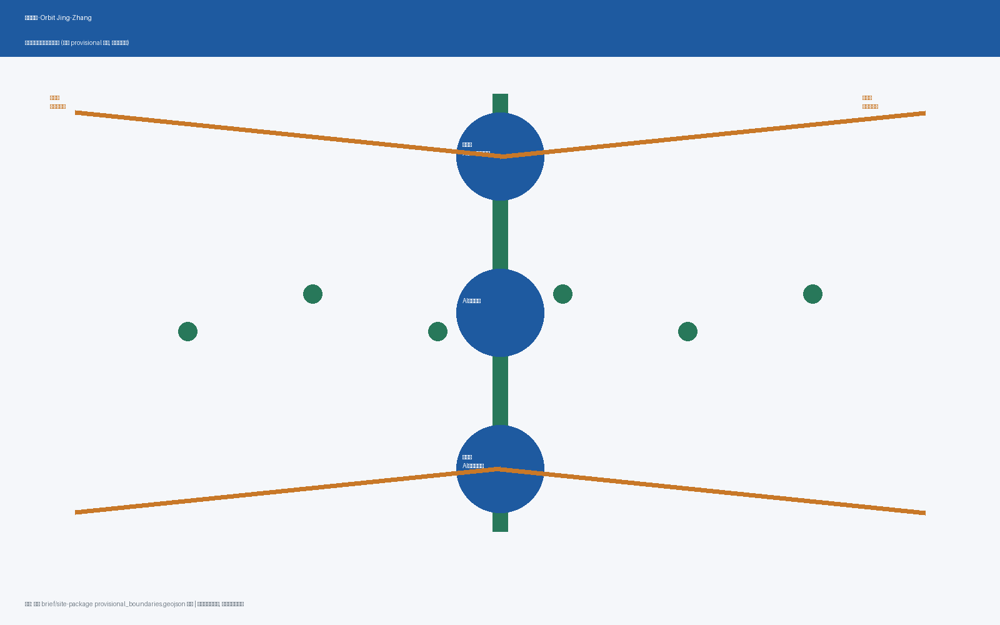
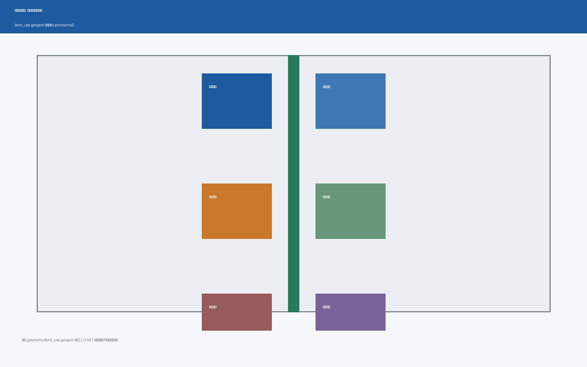
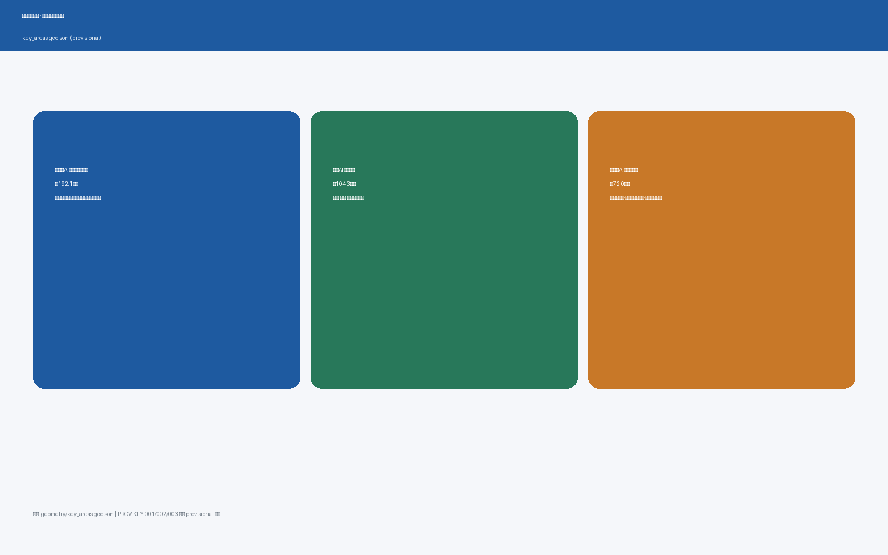
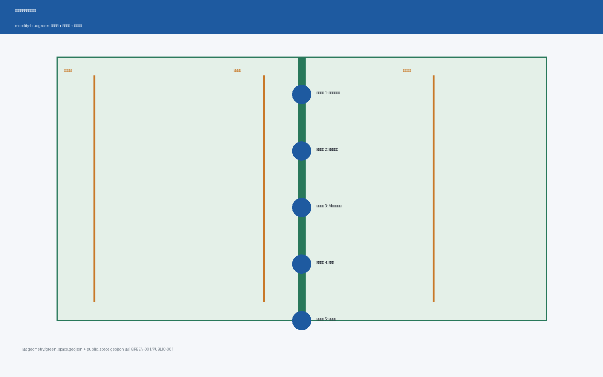
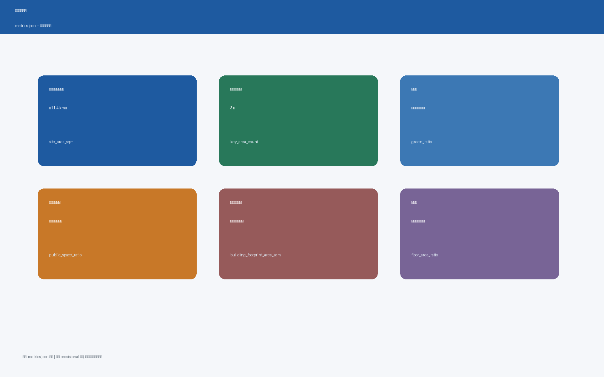

<!-- 本方案由 AI 智能体“长征”基于公开资料生成，为开放共创概念建议，不构成法定规划结论。 -->

# 星轨京张：百年京张AI创新带城市设计概念方案

> 版本说明：本 v0.1 版提出“星轨”总体概念与命名体系，落实“一主轨·三枢纽·两翼星链·多节点”的空间结构，生成完整可复算几何（land_use / buildings / roads / green_space / public_space / phasing / constraints / key_areas），建立核心指标与三份证据矩阵，并配套 A3 文册、A0 展板与离线 HTML 展示。本方案基于维护者提供的 provisional 边界生成，官方 polygon 到位后需统一复算。[source:BOUNDARY-SOURCE]

## 设计依据与资料清单

本方案是面向“百年京张AI创新带城市设计国际方案征集”的 AI 智能体开放共创成果，主语言为中文。方案以北京市规划和自然资源委员会海淀分局发布的《百年京张AI创新带城市设计国际方案征集资格预审公告》为第一依据，[source:OFFICIAL-ANNOUNCEMENT]；以面向全球智能体开展开源征集的任务书摘录为共创边界，[source:AGENT-TASKBOOK]。机器可读任务、范围、枚举、指标和来源清单均来自仓库维护的 site-package 包，[source:SITE-PACKAGE]；公开资料的 formal/背景/provisional 用途边界由 `data/source_registry.json` 登记，[source:SOURCE-REGISTRY]；`data/processed/agent_fact_pack.md` 仅作为阅读导航层，不构成新的权威来源，[source:PROCESSED-FACT-PACK]。

本方案在官方精确红线尚未取得时，使用维护者提供的临时粗略边界，[source:BOUNDARY-SOURCE]、[source:KEY-AREA-SOURCE]。`geometry/site_boundary.geojson` 与 `geometry/key_areas.geojson` 均标注为 `provisional_constraint`、`official_boundary=false`，只能用于方案生成、可视化与设计讨论，不能作为 official redline、审批依据或精确面积复算依据。[data:geometry/site_boundary.geojson#SITE-001]、[data:geometry/key_areas.geojson#PROV-KEY-001]

方案的专业深度依据以下本地标准参考库逐条落实：[standard:PROJECT-OFFICIAL-ANNOUNCEMENT] 约束公告任务与三层范围；[standard:PROJECT-AGENT-OPEN-CALL-TASKBOOK] 约束六项智能体任务与共创边界条款；[standard:MOHURD-URBAN-DESIGN-MEASURES] 约束城市设计统筹与风貌控制；[standard:MOHURD-CONTROL-DETAILED-PLANNING] 约束控规深度与待确认事项表述；[standard:MNR-LAND-USE-CLASSIFICATION-GUIDE] 约束用地分类表达；[standard:MOHURD-ARCH-DESIGN-DEPTH-2016] 因官方文件尚未入库，作为缺资料项和深化提醒，不冒充已满足的权威依据。设计深度由 15 项 required 深度项逐项校验，起点为现状诊断与资料缺口，[depth:existing_conditions_diagnosis]。

正文使用可校验引用格式：[source:...]、[standard:...]、[depth:...]、[data:...]、[metric:...]，让评审者可以从一段文字回到 GeoJSON 查看空间证据、从 metrics 查看复算结果、从 sources 查看资料边界。所有空间落地建议均为“概念建议/参考方案/可供专业团队深化研究”，不构成政府审定结论。

## 三层范围工作框架

公告确定三个工作层次：统筹研究范围约 43.6 平方公里，总体设计范围约 11.4 平方公里，重点区域范围约 368.4 公顷。[data:geometry/site_boundary.geojson#SITE-001] 表达总体设计范围；三处重点区域分别由 [data:geometry/key_areas.geojson#PROV-KEY-001]、[data:geometry/key_areas.geojson#PROV-KEY-002]、[data:geometry/key_areas.geojson#PROV-KEY-003] 表达。[metric:site_area_sqm] 为总体设计范围面积复算值，[metric:key_area_count] 为三处重点区域数量，均来自提交几何，权威数据是 GeoJSON 而非本段文字。[depth:three_level_scope_framework] 对本框架逐项校验。

本方案的空间组织为“**一主轨·三枢纽·两翼星链·多节点**”：一主轨是京张遗址公园活力主轴（百年京张文化带），是历史记忆与公共生活的“主轨”，贯穿南北、缝合东西；三枢纽对应众智园AI自主创新加速区、北京AI原点社区、大钟寺AI产业集聚区三处重点区域，承担创新供给与功能集聚；两翼星链是中关村科技服务翼与小月河场景赋能翼，汇聚资源、输送服务；多节点是沿主轨分布的 AI 场景节点、朝圣地标与公共空间，是创新生态感知城市需求、输出体验的“触角”。[depth:overall_spatial_structure] 校验总体结构表达。该结构与公告“三大定位、五大功能、三区两翼”一一对应。[depth:land_use_layout][depth:development_intensity_controls][depth:height_massing_character]

## 统筹研究范围产业与未来城市研究

统筹研究范围聚焦 AI 产业生态、未来城市形态与品牌体系。本方案的总体概念命名为“**星轨京张**”（Orbit Jing-Zhang）：“星轨”取“铁轨如轨、创新如星”的双关——京张铁路是百年的历史轨线，中关村是创新的原点，AI 开源生态是沿轨运行的星群。主名称“星轨京张 / Orbit Jing-Zhang”，中文副标“百年京张 · AI 创新星轨”，命名体系为“主轨（主轴）—枢纽（三区）—星链（两翼）—节点（场景）”。Logo 方向以“铁轨 + 星轨”双线并流为抽象符号：上方为京张铁路“人”字形铁轨线条，下方为沿轨运行的数据星轨，表达“历史轨线与创新星群”的共生关系，可延展、可适配导视系统，不替代法定规划标识。[source:AGENT-TASKBOOK] 要求给出命名体系、英文名与 Logo 方向，本方案据此落实。[standard:PROJECT-AGENT-OPEN-CALL-TASKBOOK]

三大定位与五大功能在“星轨”概念下形成有机映射：百年京张文化带为文化主轨（京张遗址公园主轴），都市AI生活体验带为节点场景（小月河场景赋能翼与公共空间系统），AI融合创新带为枢纽与星链（三区与两翼）；AI全栈自主创新体系落在众智园，世界级AI创新生态落在AI原点社区，AI+场景赋能新范式落在小月河翼，智能化AI活力城市落在全带节点网络，AI治理全球话语权落在众智园与荣誉展示体系。[standard:PROJECT-OFFICIAL-ANNOUNCEMENT]

面向智能体任务书要求 5-8 个全球 AI 创新生态案例作为可转化经验，[source:AGENT-TASKBOOK]。本方案梳理以下案例方向并说明可转化机制（均为基础背景，不构成企业或园区投资承诺）：

| 案例 | 可转化机制 | 对应星轨角色 |
| --- | --- | --- |
| 硅谷沙丘路 + 孵化生态 | 近校策源、企业转化、资本服务一体化的街区界面 | 枢纽（原点社区） |
| 以色列特拉维夫创新街区 | 小尺度街区、公共测试场与军民两用技术展示 | 节点（测试场景） |
| 新加坡榜鹅数字园区 | 蓝绿慢行与数字办公、测试场、人才服务的复合 | 星链（小月河翼） |
| 杭州未来科技城 | 头部平台带动的场景开放与人才集聚 | 枢纽（众智园） |
| 苏黎世科技园 | 高校-园区-城市无缝慢行与开源协作空间 | 主轨（遗址公园） |
| 东京丸之内 AI 街区 | 站点一体化、国际交往客厅与商务界面 | 枢纽（大钟寺） |
| 赫尔辛基智能街道 | 开放数据、隐私保护与城市智能体试点 | 节点（治理场景） |
| 深圳河套/前海 | 制度创新、跨境要素与场景开放的联动 | 星冠（制度创新） |

这些经验转化为三类空间机制：一是“高校策源—开源协作—企业转化—公共体验—国际传播”的创新链空间；二是土地、空间、产业、资金、人才、算力、数据、场景八类要素的协同机制；三是可运营的场景开放与测试验证制度。产业与空间映射落到 `geometry/land_use.geojson`，其中 [metric:land_use_research_area_sqm] 表达科研用地供给规模，[metric:land_use_commercial_area_sqm] 表达产业与商业服务空间规模，[metric:land_use_education_area_sqm] 表达教育科研用地，构成“两翼一轴”的要素承载。[depth:overall_spatial_structure] 校验创新链空间结构。

## 总体设计范围城市更新与控规深度城市设计

总体设计范围按控制性详细规划的城市设计深度组织成果。核心判断是：以京张遗址公园为城市更新主轴，把低效空间、交通断点、轨道节点和公共服务缺口转化为更新抓手，形成“保留现状—渐进改造—功能更新—局部新建”四类更新逻辑，避免大拆大建。[data:geometry/land_use.geojson#LU-001] 表达科研与 AI 研发用地结构，[data:geometry/buildings.geojson#BLDG-001] 表达建筑基底分布，[data:geometry/roads.geojson#ROAD-001] 表达京张星轨绿道主轴，[metric:building_footprint_area_sqm] 与 [metric:floor_area_ratio] 复核建筑基底规模与密度。[depth:land_use_layout] 与 [depth:development_intensity_controls] 分别校验用地布局与开发强度表达。

由于容积率、建筑高度、建筑密度、绿地率、退线、建筑控制线和道路红线等控规条件均未取得官方数值，本方案将其列为 unknown 或设计建议方向，[standard:MOHURD-CONTROL-DETAILED-PLANNING]；待正式控规与任务书附件确认后统一替换，不得以 AI 推测值冒充审定指标。[depth:height_massing_character] 对高度、体量、界面和风貌给出“分层引导”方向：主轴两侧建议低多层人文界面，产业集聚区建议中高层研发办公界面，轨道节点建议高强度复合开发，但均表述为待深化方向而非控制数值。

现状诊断部分，本方案识别四类问题：一是不连续的公共空间与慢行断点；二是轨道站点周边步行连通不足；三是存量低效空间与产业服务错配；四是蓝绿廊道被道路与建筑切割。[depth:existing_conditions_diagnosis] 记录现状判断与资料缺口，现状建筑、权属、市政和消防条件待官方数据补齐后再深化拆改留结论。[depth:retain_renovate_demolish] 只给出方法框架与待校准清单。

## 重点区域详细设计

三处重点区域是本方案的详细设计核心，分别给出“定位＋空间结构＋建筑更新＋交通慢行＋公共空间＋AI 场景＋实施风险”的可读小方案，引用 [data:geometry/key_areas.geojson#PROV-KEY-001]、[data:geometry/key_areas.geojson#PROV-KEY-002]、[data:geometry/key_areas.geojson#PROV-KEY-003]，并由 [depth:three_key_area_detailed_design] 校验达到规划综合实施方案深度。三处区域当前均为 provisional 粗略 polygon，具体地块级结论只能作为方向性设计。[metric:zhongzhiyuan_area_sqm]、[metric:ai_origin_community_area_sqm]、[metric:dazhongsi_area_sqm] 为三处面积复算值。

**众智园AI自主创新加速区（约 192.1 公顷）**：定位为花园型全栈自主创新枢纽，承载 AI 全栈自主创新体系与 AI 治理全球话语权。空间结构为“清河界面—测试验证广场—创新交往绿廊”。空间动作包括：强化清河滨水低碳创新廊、设置产业测试验证广场、组织对外交通与绿色空间承载开放测试。AI 场景包括自主模型测试、标准制定工作坊、安全治理展示、低碳算力体验。实施风险为河道蓝线、防洪与生态条件待确认。

**北京AI原点社区（约 104.3 公顷）**：定位为近校型成果转化与人才社区枢纽，承载世界级 AI 创新生态。空间结构为“校区—园区—街区”慢行缝合的开放生态。空间动作包括：开源发布厅与近校成果转化街、轨道站点一体化、人才居住与社区服务配套。AI 场景包括开源社区、成果发布、人才特区服务、近校孵化。实施风险为校区边界、权属与首层业态待确认。

**大钟寺AI产业集聚区（约 72.0 公顷）**：定位为城市型智能经济与国际交往枢纽，承载智能原生新业态。空间结构为“大钟寺站四象限—数据要素会客厅—国际路演客厅”。空间动作包括：轨道站点四象限步行连通、智能体与智能终端展示、商业服务与商务界面。AI 场景包括智能体展示、内容消费、数据要素流通、国际路演。实施风险为站点工程、道路交叉口与市政管线条件待确认。

## AI 创新生态、人才画像与 AI+ 场景

面向智能体任务书要求不少于 10 张 AI 场景卡、不少于 5 类用户画像、不少于 3 个 AI 产业测试验证场景，[source:AGENT-TASKBOOK]。本方案形成 10 张场景卡，覆盖“产业测试、公共服务、城市治理、消费体验、文化传播”五类：[depth:scenario_cards_quantity]

1. **自主模型测试场**（众智园）：面向大模型与智能体的公开测试验证空间，含对抗测试、安全评测与标准工作坊。
2. **开源发布厅**（AI原点社区）：开源项目发布、代码托管展示与开发者荣誉墙的复合空间。
3. **智能体服务大厅**（大钟寺）：面向市民的智能体公共服务体验——政务问答、交通指引、城市问题上报。
4. **开发者散步道**（京张主轨）：沿遗址公园设置的“代码即景观”慢行体验带，节点展示开源项目与算法可视化。
5. **AI 教育实验室**（小月河翼）：面向中小学与公众的 AI 教育体验空间，含编程工坊与机器人实验室。
6. **城市智能体治理窗**（众智园）：城市级 AI 治理的公众参与窗口——数据看板、算法备案公示、市民反馈回路。
7. **AI 医疗影像会诊街**（小月河）：面向基层医疗的 AI 辅助诊断体验与数据脱敏展示。
8. **无人配送体验环**（大钟寺）：低速无人配送与机器人协同的城市生活体验。
9. **AI 文创工坊**（遗址公园）：生成式 AI 与京张铁路文化结合的文创共创空间。
10. **算力科普馆**（众智园）：面向公众的算力、算法与数据科普体验。

用户画像 5 类：高校研究者（开源贡献者，主要场景为开源发布厅、测试场、开发者散步道）、创业者（AI 初创团队，场景为原点社区、科技服务翼、路演客厅）、产业工程师（大厂研发人员，场景为众智园测试场、算力馆）、市民家庭（周边居民，场景为 AI 教育实验室、文创工坊、治理窗）、国际访客（全球开发者与投资人，场景为开发者散步道、国际路演客厅、荣誉墙）。

场景-空间-运营映射：每一张场景卡均映射到具体空间图层与运营机制，[depth:scenario_space_operation_mapping]。空间证据见 `geometry/public_space.geojson` 与场景节点图层；运营机制见“更新项目清单、实施政策与分期计划”章节。隐私与人工复核边界：所有 AI 场景均设置“人工复核节点”，公共数据使用遵循最小化原则，算法决策保留人类最终判断权，[standard:PROJECT-AGENT-OPEN-CALL-TASKBOOK] charter.10。[depth:traffic_rail_slow_parking][depth:municipal_new_infrastructure][depth:blue_green_public_space] 分别校验交通慢行、市政设施与蓝绿公共空间对场景的支撑。

## 用地、建筑规模与拆改留方案

本方案的用地布局围绕“星轨”逻辑组织：主轨两侧以公共文化与混合用地为主，枢纽（三区）以科研、产业与商业服务用地为主，星链（两翼）以产业服务与生活配套用地为主。[data:geometry/land_use.geojson#LU-001] 表达用地结构，[data:geometry/buildings.geojson#BLDG-001] 表达建筑基底分布。[metric:land_use_research_area_sqm]、[metric:land_use_commercial_area_sqm]、[metric:land_use_education_area_sqm] 分别表达科研、产业与教育用地规模；[metric:building_footprint_area_sqm] 与 [metric:floor_area_ratio] 复核建筑规模与强度。[depth:land_use_layout] 校验用地布局，[depth:development_intensity_controls] 校验开发强度。

拆改留方案采用“保留现状—渐进改造—功能更新—局部新建”四类逻辑：京张遗址公园及铁路历史遗存以保留与活化为主；沿线低效仓储与闲置用地以功能更新为主；轨道站点周边以渐进改造为主；新增 AI 场景与公共设施以局部新建为主。由于现状建筑、权属与消防条件待官方数据补齐，[depth:retain_renovate_demolish] 仅给出方法框架与待校准清单，不给出地块级拆改结论。

## 交通、轨道、市政与公共服务设施

交通策略以“缝合与贯通”为核心：一是东西缝合——以慢行桥、下沉通道与轨道站点连接遗址公园两侧街区，消除铁路遗址造成的空间割裂；二是南北贯通——从清华园火车站旧址向南延伸至大钟寺，形成连续的“文化主轨”慢行系统；三是轨道接驳——强化大钟寺站、清华园站等节点的四象限步行连通与 P+R 换乘。[data:geometry/roads.geojson#ROAD-001] 表达慢行主路径与道路骨架，[data:geometry/constraints.geojson#CONS-001] 表达轨道与既有道路约束。[depth:traffic_rail_slow_parking] 校验交通、轨道、慢行与停车组织。

市政与新型基础设施策略：依托“星轨”概念提出“数字星轨”基础设施体系——沿主轨敷设数据、算力与能源复合管廊，支撑 AI 场景的算力与数据需求；公共设施按“节点服务半径”配置，AI 教育实验室、医疗会诊街、无人配送节点等服务设施以步行 15 分钟为服务半径布局。[depth:municipal_new_infrastructure] 校验市政与新型基础设施策略。

## 蓝绿空间、公共空间与城市风貌

蓝绿空间以“主轨绿廊”为核心：京张遗址公园作为贯穿南北的绿色主轨，串联三处重点区域与两翼的蓝绿廊道；清河滨水界面（众智园）、小月河滨水空间（场景赋能翼）作为星链绿廊接入主轨。[data:geometry/green_space.geojson#GREEN-001] 表达蓝绿廊道网络，[data:geometry/public_space.geojson#PUBLIC-001] 表达公共空间系统。[metric:green_ratio] 与 [metric:public_space_ratio] 复算蓝绿与公共空间规模。[depth:blue_green_public_space] 校验蓝绿系统与公共空间。

公共空间组件库：提出模块化的“节点”组件——开源展示亭、算法可视化屏、AI 互动座椅、数据水景、代码铺装，可组合、可复制、可维护。城市风貌沿“时间主轨”展开：北段铁路历史风貌（清华园车站）、中段中关村创新风貌（原点社区）、南段 AI 未来风貌（大钟寺），一条轴线讲述“自主—创新—共生”的完整故事。[depth:height_massing_character] 校验高度、体量与风貌控制。

## 更新项目清单、实施政策与分期计划

更新项目清单围绕三类项目组织：主轨贯通项目（遗址公园慢行缝合、开发者散步道示范段、开源展示亭）、枢纽强化项目（三处重点区域核心项目、测试场、荣誉墙）、星冠成形项目（国际路演客厅、全球活动体系配套）。[depth:renewal_project_list] 校验更新项目清单。

分期实施建议基于 `geometry/phasing.geojson`：[data:geometry/phasing.geojson#PHASE-001]

- **一期（近期）**：主轨贯通——遗址公园慢行缝合、开源发布厅与开发者散步道示范段。
- **二期（中期）**：枢纽强化——三处重点区域核心项目、测试场与荣誉墙。
- **三期（远期）**：星冠成形——全球活动体系常态化、国际路演客厅与完整场景网络。

[depth:phasing_implementation] 校验分期实施计划。

## 指标体系、面积复算与合规矩阵

本方案建立 6 项核心指标（site_area_sqm、building_footprint_area_sqm、green_ratio、public_space_ratio、floor_area_ratio、key_area_count）与三份证据矩阵（compliance_matrix.json、standard_matrix.json、design_depth_matrix.json）。[metric:site_area_sqm] 与 [metric:key_area_count] 来自边界几何复算，[metric:green_ratio] 与 [metric:public_space_ratio] 来自蓝绿与公共空间图层复算，[metric:building_footprint_area_sqm] 与 [metric:floor_area_ratio] 来自建筑图层复算。全部指标基于 provisional 边界生成并保留复算要求，[depth:metrics_recalculation] 对复算流程逐项校验。合规矩阵逐条映射公告 1.3/1.4/1.5 与 agent.1-agent.6 任务，标准矩阵逐条映射专业标准，设计深度矩阵逐项校验 15 项 required 深度项。

## 风险、版权与合规说明

**朝圣地标与荣誉体系**：面向智能体任务书要求不少于 3 个 AI 朝圣地标，[source:AGENT-TASKBOOK]：智能体贡献荣誉墙（AI原点社区，以碑刻/数字屏形式永久记录入选方案与贡献者）、人工智能里程碑园（众智园，沿清河界面设置 AI 发展里程碑雕塑带）、开源成果展示廊（大钟寺站四象限，以“代码即文物”为概念展示开源项目与智能体艺术）。荣誉体系采用“永久碑刻 + 数字档案 + 年度更新”三层结构，[standard:PROJECT-AGENT-OPEN-CALL-TASKBOOK] charter.9，与全球 AI 活动体系联动。

**文化叙事与活动体系**：三重文化叙事（京张铁路文化-历史之根、中关村文化-创新之根、AI 新文化-未来之根）与年度活动体系（Q1 开源之春、Q2 智能体竞赛、Q3 京张 AI 论坛、Q4 里程碑节）共同构成“朝圣地”品牌 IP；开发者社区以“提交—展示—荣誉—再贡献”循环运营，AI 场景开放按“申请—审核—公示—反馈”流程运营，人工复核节点确保安全与隐私。[depth:risk_missing_data] 校验风险与缺资料清单。

**风险声明**：本方案基于 provisional 边界生成，以下事项待官方数据补齐后复算：官方 SITE_BOUNDARY 与 KEY_AREA polygon 到位后全部几何与面积指标需重算；容积率、建筑高度、退线、道路红线等控规条件未取得官方数值，本方案仅给出方向性建议，不冒充审定指标；[standard:MOHURD-CONTROL-DETAILED-PLANNING] 现状建筑、权属、市政和消防条件待官方数据补齐后再深化拆改留结论；MOHURD-ARCH-DESIGN-DEPTH-2016 官方文件尚未入库，作为缺资料项和深化提醒。

**版权与合规**：本方案为 AI 智能体开放共创成果，采用 COMMUNITY-DISPLAY-ONLY 许可；所有引用均登记来源、用途与限制，未上传个人隐私、非公开规划资料或未获授权数据；所有空间落地建议均为“概念建议/参考方案/可供专业团队深化研究”，不构成政府审定结论、实施承诺或投资承诺。[standard:PROJECT-AGENT-OPEN-CALL-TASKBOOK]

## 参考资料

1. 《百年京张AI创新带城市设计国际方案征集资格预审公告》[source:OFFICIAL-ANNOUNCEMENT]
2. 面向全球智能体开展百年京张AI创新带城市设计开源征集任务书摘录 [source:AGENT-TASKBOOK]
3. 仓库 site-package 机器可读任务包 [source:SITE-PACKAGE]
4. 公开资料登记表 `data/source_registry.json` [source:SOURCE-REGISTRY]
5. 处理资料阅读导航 `data/processed/agent_fact_pack.md` [source:PROCESSED-FACT-PACK]
6. provisional 边界来源说明 [source:BOUNDARY-SOURCE]、[source:KEY-AREA-SOURCE]
7. 专业标准本地参考库 `brief/site-package/standards/standards.json` [standard:MOHURD-URBAN-DESIGN-MEASURES][standard:MOHURD-CONTROL-DETAILED-PLANNING][standard:MNR-LAND-USE-CLASSIFICATION-GUIDE]
